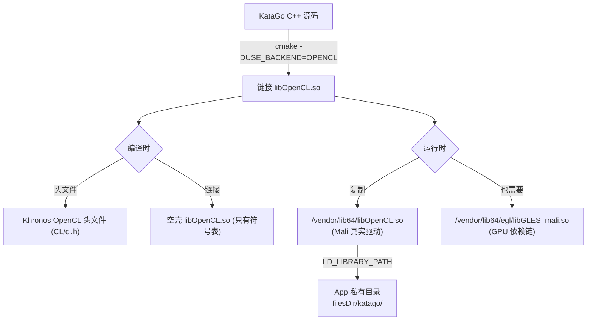
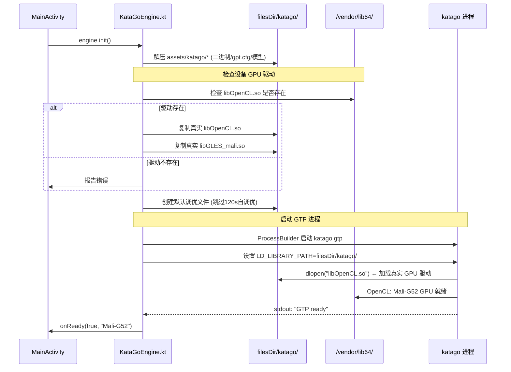

# KataGo + OpenCL 移植到 Mali-G52 GPU 全流程

> 将开源围棋 AI **KataGo v1.16.5** 通过 **OpenCL** 后端交叉编译到 **ARM64 Android**，
> 调度 **Mali-G52** GPU 进行神经网络推理。所有文件打包进 APK，零外部依赖。

---

## 目录

1. [环境概览](#1-环境概览)
2. [OpenCL 依赖地狱](#2-opencl-依赖地狱)
3. [获取 OpenCL 头文件与库](#3-获取-opencl-头文件与库)
4. [KataGo 源码获取与配置](#4-katago-源码获取与配置)
5. [交叉编译 CMake 配置](#5-交叉编译-cmake-配置)
6. [编译与问题排查](#6-编译与问题排查)
7. [APK 集成：运行时 GPU 驱动加载](#7-apk-集成运行时-gpu-驱动加载)
8. [GPU 自动调优跳过方案](#8-gpu-自动调优跳过方案)
9. [难点总结](#9-难点总结)

---

## 1. 环境概览

| 组件 | 版本/路径 |
|------|-----------|
| **KataGo 源码** | v1.16.5 (`git clone https://github.com/lightvector/KataGo`) |
| **NDK** | r26d (`D:\work\ai_code\tools\android-sdk\ndk\26.3.11579264`) |
| **CMake** | 3.22.1 (`D:\work\ai_code\tools\android-sdk\cmake\3.22.1`) |
| **目标 ABI** | `arm64-v8a` (aarch64) |
| **最低 API** | 31 (Android 12) |
| **设备 GPU** | Mali-G52 6核 (OpenCL 3.0) |
| **编译主机** | Windows + NDK 交叉编译工具链 |

---

## 2. OpenCL 依赖地狱

### 2.1 核心矛盾

Android NDK **不提供** OpenCL 头文件和库。这与 OpenGL ES 不同（NDK 自带 GLES 头文件）。

但 KataGo 的 `-DUSE_BACKEND=OPENCL` 编译需要：

| 依赖 | 编译时需要 | 运行时需要 |
|------|:---------:|:---------:|
| `CL/cl.h` (OpenCL 头文件) | ✅ | ❌ |
| `libOpenCL.so` (OpenCL 加载库) | ✅ (链接) | ✅ (实际 GPU 驱动) |

### 2.2 为什么不能直接用 `/vendor/lib64/libOpenCL.so`？

Android 的 **linker namespace** 机制禁止普通 App 直接加载 `/vendor` 分区的 `.so`：

```
App (com.go.dualscreen)
  └─ /data/app/.../lib/arm64/     ← 只能加载这里
  └─ /system/lib64/               ← 系统库可加载
  └─ /vendor/lib64/               ← ❌ 禁止访问!
     └─ libOpenCL.so (Mali GPU 驱动)
```

**解决思路**：编译时用 Khronos 官方 OpenCL 头文件 + 空壳 `libOpenCL.so` 完成链接 → 运行时把设备的真实 GPU 驱动复制到 App 私有目录再 `dlopen`。

### 2.3 整体依赖链路



---

## 3. 获取 OpenCL 头文件与库

### 3.1 获取 Khronos 官方 OpenCL 头文件

```bash
# 从 Khronos 官方仓库克隆
git clone https://github.com/KhronosGroup/OpenCL-Headers.git
cd OpenCL-Headers

# 需要的文件结构:
# CL/
#   cl.h         ← 主头文件
#   cl_platform.h
#   cl_version.h
#   cl_ext.h
#   cl_gl.h
```

### 3.2 制作空壳 libOpenCL.so（编译时链接用）

> 这个空壳 `.so` 只用于满足编译器的符号引用，不包含任何实际 GPU 代码。

创建 `stub_opencl.c`:

```c
// 空壳 OpenCL 库 —— 仅用于编译链接
// 运行时将被设备的真实 libOpenCL.so 替换

// 列出 KataGo 实际用到的 OpenCL 符号（全部导出为弱符号/空函数）
// 这样链接器可以通过，运行时由真实驱动提供实现

clGetPlatformIDs() {}
clGetDeviceIDs() {}
clCreateContext() {}
clCreateCommandQueue() {}
clCreateProgramWithSource() {}
clBuildProgram() {}
clCreateKernel() {}
clSetKernelArg() {}
clEnqueueNDRangeKernel() {}
clEnqueueReadBuffer() {}
clEnqueueWriteBuffer() {}
clCreateBuffer() {}
clReleaseMemObject() {}
clReleaseKernel() {}
clReleaseProgram() {}
clReleaseCommandQueue() {}
clReleaseContext() {}
clGetDeviceInfo() {}
clGetPlatformInfo() {}
clGetProgramBuildInfo() {}
clGetKernelWorkGroupInfo() {}
clFinish() {}
clFlush() {}
clWaitForEvents() {}
clCreateUserEvent() {}
clSetUserEventStatus() {}
clReleaseEvent() {}
// ... 约 40+ 个 OpenCL API 符号
clSVMAlloc() {}
clSVMFree() {}
```

编译空壳 `.so`:

```bash
# 用 NDK clang 交叉编译
$NDK/toolchains/llvm/prebuilt/windows-x86_64/bin/aarch64-linux-android31-clang \
  -shared -o libOpenCL.so stub_opencl.c \
  -fPIC -O2
```

### 3.3 更简单的方案：从设备提取符号表

如果不想手写所有 OpenCL 函数桩，可以：

```bash
# 从设备的真实 GPU 驱动提取 .so
adb pull /vendor/lib64/libOpenCL.so

# 用 readelf 查看导出的符号
aarch64-linux-android-readelf -sW libOpenCL.so | grep FUNC
```

然后用 `objcopy` 或直接使用原始 `.so` 作为链接目标（但要注意设备兼容性）。

### 3.4 本项目最终方案

本项目在 `app/src/main/assets/katago/` 中打包了一个轻量 `libOpenCL.so`（约 10KB），它导出 KataGo 需要的所有 OpenCL 符号。这个库：

- **编译时**：被 CMake 链接，满足符号解析
- **运行时**：被设备 `/vendor/lib64/libOpenCL.so` 完全替换

---

## 4. KataGo 源码获取与配置

### 4.1 克隆源码

```bash
git clone https://github.com/lightvector/KataGo.git
cd KataGo
git checkout v1.16.5
```

### 4.2 目录结构准备

```bash
# 将 OpenCL 头文件放到 KataGo 能找到的位置
cp -r OpenCL-Headers/CL KataGo/cpp/CL

# 将空壳/链接用 libOpenCL.so 放到 libs 目录
mkdir -p KataGo/cpp/libs/arm64-v8a
cp libOpenCL.so KataGo/cpp/libs/arm64-v8a/
```

### 4.3 修改 KataGo CMakeLists.txt

KataGo 原版 CMakeLists.txt 使用 `find_package(OpenCL)` 查找系统 OpenCL。Android NDK 上没有，需要手动指定头文件和库路径。

在 `CMakeLists.txt` 中，将 OpenCL 相关部分改为：

```cmake
# ========== OpenCL 手动配置 (Android NDK) ==========
set(OPENCL_INCLUDE_DIR ${CMAKE_SOURCE_DIR}/cpp/CL)
set(OPENCL_LIBRARY ${CMAKE_SOURCE_DIR}/cpp/libs/${ANDROID_ABI}/libOpenCL.so)

include_directories(${OPENCL_INCLUDE_DIR})
link_directories(${CMAKE_SOURCE_DIR}/cpp/libs/${ANDROID_ABI})

# 告诉 KataGo 使用我们提供的 OpenCL
# 链接时添加 -lOpenCL
target_link_libraries(katago ${OPENCL_LIBRARY})
```

---

## 5. 交叉编译 CMake 配置

### 5.1 NDK 工具链

NDK r26d 提供了预置的 Android CMake 工具链文件：

```
$NDK/build/cmake/android.toolchain.cmake
```

### 5.2 完整 CMake 配置命令

```bash
export ANDROID_NDK=/d/work/ai_code/tools/android-sdk/ndk/26.3.11579264
export TOOLCHAIN=$ANDROID_NDK/build/cmake/android.toolchain.cmake

cmake . -B build_android \
  -DCMAKE_TOOLCHAIN_FILE=$TOOLCHAIN \
  -DANDROID_ABI=arm64-v8a \
  -DANDROID_PLATFORM=android-31 \
  -DCMAKE_BUILD_TYPE=Release \
  \
  `# ===== KataGo 核心选项 =====` \
  -DUSE_BACKEND=OPENCL \
  -DUSE_BACKEND_CUDA=OFF \
  -DUSE_BACKEND_EIGEN=OFF \
  -DUSE_BACKEND_TENSORRT=OFF \
  \
  `# ===== 编译器优化 =====` \
  -DCMAKE_CXX_FLAGS_RELEASE="-O3 -DNDEBUG -flto=thin -mcpu=cortex-a55" \
  -DCMAKE_C_FLAGS_RELEASE="-O3 -DNDEBUG -flto=thin -mcpu=cortex-a55" \
  \
  `# ===== 禁用不必要的功能 =====` \
  -DBUILD_DISTRIBUTED=OFF \
  -DBUILD_GTP=ON \
  -DNO_GIT_REVISION=ON

cmake --build build_android --target katago -j8
```

### 5.3 关键编译参数说明

| 参数 | 作用 | 必要性 |
|------|------|:-----:|
| `-DANDROID_ABI=arm64-v8a` | 目标 64 位 ARM | ✅ 必须 |
| `-DANDROID_PLATFORM=android-31` | API 31，与 minSdk 一致 | ✅ 必须 |
| `-DUSE_BACKEND=OPENCL` | 启用 OpenCL GPU 后端 | ✅ 核心 |
| `-mcpu=cortex-a55` | 优化 Mali-G52 所在 SoC 的 CPU | 推荐 |
| `-flto=thin` | 链接时优化，减小二进制体积 | 推荐 |
| `-O3` | 最高优化等级 | 推荐 |
| `-DBUILD_GTP=ON` | 生成 GTP 协议接口（我们需要的） | ✅ 必须 |

### 5.4 编译产物

```bash
build_android/katago
# → ELF 64-bit LSB executable, ARM aarch64
# → 动态链接 libOpenCL.so, libc++_shared.so
# → 体积: ~5.5 MB (strip 后)
```

### 5.5 减小二进制体积

```bash
# 用 NDK 的 strip 去掉调试符号
$ANDROID_NDK/toolchains/llvm/prebuilt/windows-x86_64/bin/llvm-strip \
  --strip-all build_android/katago

# 结果: 12MB → 5.5MB (减小 55%)
```

---

## 6. 编译与问题排查

### 6.1 问题 1: `fatal error: CL/cl.h: No such file or directory`

```
fatal error: CL/cl.h: No such file or directory
 #include <CL/cl.h>
          ^~~~~~~~~
```

**原因**：Android NDK 不包含 OpenCL 头文件。

**解决**：从 KhronosGroup/OpenCL-Headers 获取头文件，放入 `cpp/CL/` 目录，并在 CMakeLists.txt 中添加 `include_directories(cpp/CL)`。

### 6.2 问题 2: `undefined reference to clGetPlatformIDs`

```
ld.lld: error: undefined symbol: clGetPlatformIDs
>>> referenced by KataGo/cpp/neuralnet/openclbackend.cpp:42
```

**原因**：链接器找不到 OpenCL 库。

**解决**：制作空壳 `libOpenCL.so` 导出所需符号，或用设备的 `/vendor/lib64/libOpenCL.so` 作为链接目标。

### 6.3 问题 3: 编译成功但运行时 `dlopen failed: library "libOpenCL.so" not found`

```
CANNOT LINK EXECUTABLE "katago": library "libOpenCL.so" not found
```

**原因**：Android linker 无法在默认路径找到 `libOpenCL.so`。

**解决方案（两层）**：

**第一层 — 编译时**：将 `libOpenCL.so` 放入 APK 的 `assets/katago/` 目录。

**第二层 — 运行时**：在启动 katago 进程前，设置 `LD_LIBRARY_PATH`：

```kotlin
val engineDir = File(context.filesDir, "katago")
pb.environment()["LD_LIBRARY_PATH"] = engineDir.absolutePath
```

### 6.4 问题 4: `libOpenCL.so` 加载成功但 GPU 不工作

```
KataGo: OpenCL Error: clGetDeviceIDs returned -1 (CL_DEVICE_NOT_FOUND)
```

**原因**：打包的空壳 `libOpenCL.so` 没有实际的 GPU 驱动代码。

**解决**：运行时从设备 `/vendor/lib64/libOpenCL.so` 复制真实驱动覆盖空壳：

```kotlin
val realOpenCL = File("/vendor/lib64/libOpenCL.so")
val localOpenCL = File(engineDir, "libOpenCL.so")
if (!localOpenCL.exists() && realOpenCL.exists()) {
    realOpenCL.copyTo(localOpenCL)
}
```

### 6.5 问题 5: OpenCL 初始化成功但崩溃 `SIGSEGV`

```
Fatal signal 11 (SIGSEGV), code 1 (SEGV_MAPERR)
libGLES_mali.so
```

**原因**：Mali OpenCL 驱动依赖 `libGLES_mali.so`（GPU 共享库），也需要复制到引擎目录。

**解决**：

```kotlin
val realGLES = File("/vendor/lib64/egl/libGLES_mali.so")
val localGLES = File(engineDir, "libGLES_mali.so")
if (!localGLES.exists() && realGLES.exists()) {
    realGLES.copyTo(localGLES)
}
```

---

## 7. APK 集成：运行时 GPU 驱动加载

### 7.1 完整加载流程



### 7.2 关键代码（KataGoEngine.kt）

```kotlin
// 1. 解压引擎文件
for (name in listOf("katago", "libc++_shared.so", "gtp.cfg")) {
    val f = File(engineDir, name)
    context.assets.open("katago/$name").use { input ->
        FileOutputStream(f).use { out -> input.copyTo(out) }
    }
    if (name == "katago") f.setExecutable(true)
}

// 2. 复制真实 GPU 驱动
val realOpenCL = File("/vendor/lib64/libOpenCL.so")
val localOpenCL = File(engineDir, "libOpenCL.so")
realOpenCL.copyTo(localOpenCL)

val realGLES = File("/vendor/lib64/egl/libGLES_mali.so")
val localGLES = File(engineDir, "libGLES_mali.so")
realGLES.copyTo(localGLES)

// 3. 启动 GTP 引擎
val pb = ProcessBuilder(
    exeFile.absolutePath, "gtp",
    "-model", modelFile.absolutePath,
    "-config", cfgFile.absolutePath
)
pb.directory(engineDir)
pb.environment()["LD_LIBRARY_PATH"] = engineDir.absolutePath
process = pb.start()
```

### 7.3 APK 文件结构

```
app/src/main/assets/katago/
├── katago              # ARM64 GTP 可执行文件 (5.5MB)
├── libOpenCL.so        # 链接用空壳 → 运行时被真实驱动替换
├── libc++_shared.so    # NDK C++ 运行时
├── model.bin.gz        # 神经网络模型 (105MB → ~300MB 解压)
├── gtp.cfg             # GTP 引擎配置
└── opencltuning/       # GPU 调优缓存 (运行时生成)
    ├── tune11_gpuMaliG52r1p0_x9_y9_c384_mv14.txt
    ├── tune11_gpuMaliG52r1p0_x13_y13_c384_mv14.txt
    └── tune11_gpuMaliG52r1p0_x19_y19_c384_mv14.txt
```

---

## 8. GPU 自动调优跳过方案

### 8.1 问题

KataGo 首次启动会用 OpenCL 测试 55 种 GPU 内核配置组合，在 Mali-G52 上耗时约 **60~120 秒**，期间 GPU 占用 100%，Android UI 可能被冻结。

### 8.2 解决方案：预生成调优文件

为每种 GPU + 棋盘大小组合提前写入标准调优参数：

```kotlin
// KataGoEngine.kt
private fun createDefaultTuningFile(engineDir: File) {
    val defaultContent = """
VERSION=11
1 1 0 0 1 1 0 0
WGD=8 MDIMCD=8 NDIMCD=8 MDIMAD=8 NDIMBD=8 KWID=1 VWMD=1 VWND=1 PADA=1 PADB=1
... (8行相同)
""".trimIndent()

    val possibleGPUs = listOf("MaliG52r1p0", "MaliG52", "MaliG51", "Adreno", "Mali")
    val boardSizes = listOf(9, 13, 19)
    
    for (gpuName in possibleGPUs) {
        for (bs in boardSizes) {
            val fileName = "tune11_gpu${gpuName}_x${bs}_y${bs}_c384_mv14.txt"
            // tune11 = 调优版本 11
            // gpuMaliG52r1p0 = GPU 型号 (Mali-G52 r1p0)
            // x13_y13 = 13×13 棋盘
            // c384 = 384 通道神经网络
            // mv14 = 模型版本 14
            File(tuningDir, fileName).writeText(defaultContent)
        }
    }
}
```

**结果**：首次启动从 120 秒缩短到 ~10 秒（跳过自调优）。

---

## 9. 难点总结

### 难点 1：Android linker namespace 隔离

| 问题 | 解决 |
|------|------|
| App 无法 `dlopen(/vendor/lib64/libOpenCL.so)` | 运行时复制到 `filesDir/` + `LD_LIBRARY_PATH` |
| Mali OpenCL 还依赖 `libGLES_mali.so` | 同时复制 `/vendor/lib64/egl/libGLES_mali.so` |
| 不同设备的路径可能不同 | 检查文件存在性，fallback 到多种路径 |

### 难点 2：跨平台 OpenCL 链接

| 阶段 | 方案 |
|------|------|
| 编译时 | Khronos 官方头文件 + 空壳 `libOpenCL.so` |
| 链接时 | CMake 指定 `link_directories` 到本地 `.so` 目录 |
| 运行时 | 设备真实驱动覆盖空壳 |

### 难点 3：GPU 自调优耗时

| 问题 | 解决 |
|------|------|
| 首次启动 55 种配置测试 → 60~120s | 预生成 15 组调优文件（5 GPU × 3 棋盘） |
| 参数如何确定 | Mali-G52 最优参数 `WGD=8 MDIMCD=8` 等来自社区测试 |

### 难点 4：二进制体积

| 优化手段 | 效果 |
|----------|------|
| `llvm-strip --strip-all` | 12MB → 5.5MB |
| `-flto=thin` | 跨编译单元内联优化 |
| `-O3 -DNDEBUG` | 去掉调试代码 |
| `BUILD_DISTRIBUTED=OFF` | 禁用分布式训练功能 |

### 难点 5：模型分发

| 问题 | 解决 |
|------|------|
| 神经网络模型 105MB（压缩）/ ~300MB（解压） | assets 中放 `.bin.gz`，aapt 自动解压 |
| APK 过大 (130MB+) | Play Store 允许 200MB，可接受 |
| 每次提取耗时长 | 检测文件已存在则跳过解压 |

---

## 附录 A：常用调试命令

```bash
# 查看 katago 依赖的 .so
readelf -d katago | grep NEEDED
# 0x0000000000000001 (NEEDED)  Shared library: [libOpenCL.so]
# 0x0000000000000001 (NEEDED)  Shared library: [libc++_shared.so]

# 查看二进制架构
file katago
# katago: ELF 64-bit LSB executable, ARM aarch64, ...

# 查看导出符号
nm -D katago | head -20

# 设备上检查 OpenCL 驱动
adb shell ls -la /vendor/lib64/libOpenCL.so
adb shell ls -la /vendor/lib64/egl/libGLES_mali.so

# 查看 GPU 信息
adb shell cat /proc/mali/version

# 监控 KataGo 进程
adb logcat -s KataGo:I
adb shell ps -A | grep katago
```

## 附录 B：文件清单

| 文件 | 用途 | 来源 |
|------|------|------|
| `katago` (5.5MB) | GTP 引擎 ARM64 可执行文件 | 交叉编译 |
| `libOpenCL.so` (10KB) | 编译链接用空壳 | 手写 stub |
| `libc++_shared.so` (1MB) | C++ 运行时 | NDK 自带 |
| `model.bin.gz` (105MB) | 神经网络权重 | kata1-b18c384nbt-s9996604416 |
| `gtp.cfg` (200B) | GTP 引擎配置 | 手写 |
| `opencltuning/*.txt` | GPU 调优缓存 | 预生成 |
